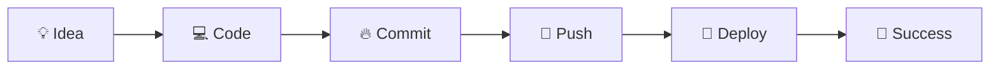

<div align="center">

update 1 
update 2    
  
# 🦈 SHARK REPO


<br>


<br><br>


</div>

---

# 🌊 About Shark Repo

```yaml
Project: Shark Repo
Creator: GurmanSingh7
Theme: Ocean + Sharks
Status: Active 🚀
Mission: Build Powerful Open Source Projects
```

---
  
# 🦈 Features

✨ Modern Design

⚡ High Performance

🌊 Ocean Inspired UI

🔒 Secure & Reliable

📱 Responsive

🚀 Easy Deployment

🎯 Developer Friendly

---

# 🚀 Tech Stack

<div align="center">


</div>

---

# 📊 GitHub Analytics

<div align="center">


</div>

<br>

<div align="center">


</div>

---

# 🌊 Contribution Journey



---

# 📈 Activity Graph

<div align="center">


</div>

---

# 🏆 Achievements

<div align="center">


</div>

---

# 🌊 Ocean Animation 

<div align="center">


</div>

---

# 🦈 Repository Status

<div align="center">


</div>

---

# 🤝 Connect With Me

<div align="center">

<a href="https://github.com/GurmanSingh7">

</a>

</div>

---

<div align="center">

## ⭐ Thanks For Visiting Shark Repo

### 🦈 Swim Through Code • Hunt Bugs • Build Cool Stuff


</div>
